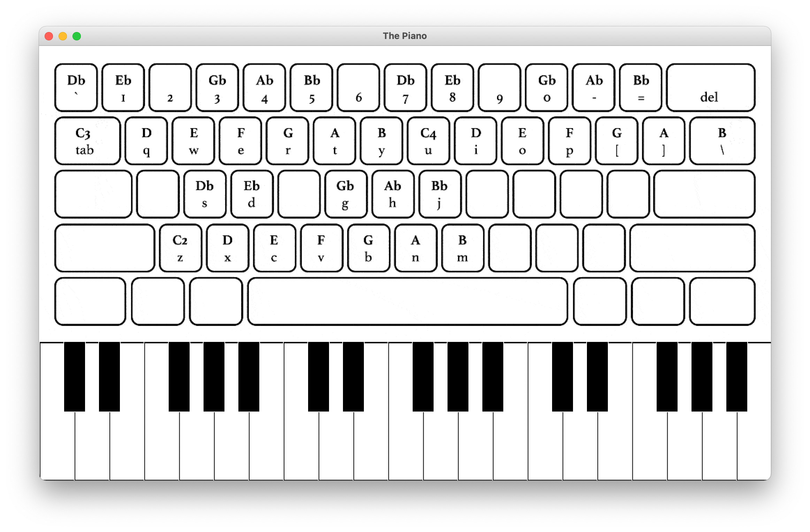

# Keyboard Piano
This project is based on [Piano](https://github.com/krishnansuki/piano). 

This software provides an interactive graphical interface of a piano. It contains octaves from 2nd to 4th, inclusive. The notes can be played by pressing keys on your computer keyboard, as well as a cursor. The mapping of keyboard keys is available in the user interface.




## Dependencies:

* **Pygame**
* **Tkinter**

## How to use:
**This program is not supported on WSL.**
To run on Windows machines, navigate into the 'piano' folder and type ```$ python3 piano.py``` in cmd and enter. 
To run on MacOS, navigate into the 'piano' folder and run ```$ python3 piano.py``` in the terminal. 
